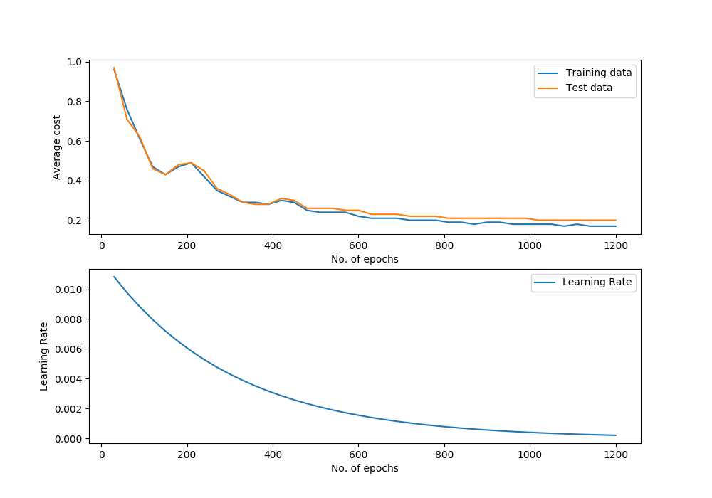
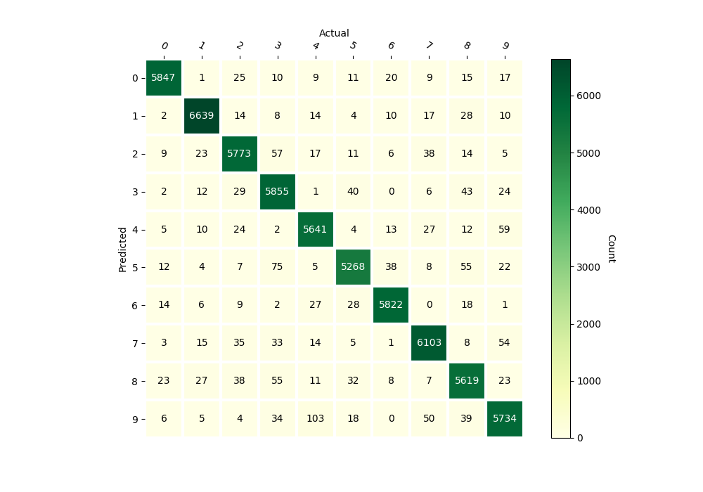

Feed-Forward Neural Network
===========================

Class Reference
---------------

.. autoclass:: pykitml.NeuralNetwork
    
    .. automethod:: __init__

    .. automethod:: feed

    .. automethod:: get_output

    .. automethod:: get_output_onehot

    .. automethod:: train

    .. automethod:: plot_performance

    .. automethod:: cost

    .. automethod:: accuracy

    .. automethod:: r2score

    .. automethod:: confusion_matrix

    .. autoattribute:: nlayers

Example: Handwritten Digit Recognition (MNIST)
----------------------------------------------

**Dataset**

:ref:`mnist_dataset`

**Training**

.. literalinclude:: ../tests/test_mnist.py
   :pyobject: test_adam
   :lines: 3-
   :end-before: # Assert
   :dedent: 4

**Predicting**

.. literalinclude:: ../tests/test_mnist.py
   :pyobject: test_predict_mnist_adam
   :lines: 3-
   :dedent: 4

**Performance Graph**

**Confusion Matrix**

