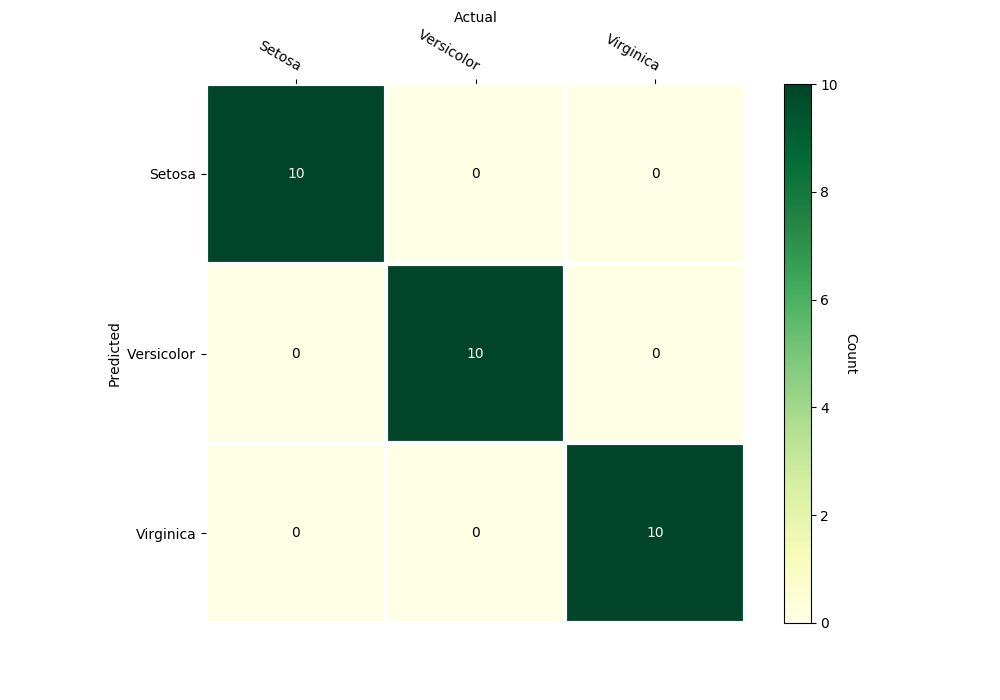

Gaussian Naive Bayes
====================

Class Reference
---------------

.. autoclass:: pykitml.GaussianNaiveBayes
    
    .. automethod:: __init__

    .. automethod:: feed

    .. automethod:: get_output

    .. automethod:: get_output_onehot

    .. automethod:: train

    .. automethod:: accuracy

    .. automethod:: confusion_matrix

Example: Classifying Iris
-------------------------

**Dataset**

:ref:`iris_dataset`

**Training**

.. literalinclude:: ../tests/test_iris_bayes.py
   :pyobject: test_iris_bayes
   :lines: 3-
   :end-before: # Assert
   :dedent: 4

**Predict type of species with sepal-length, sepal-width, petal-length, petal-width: 
5.8, 2.7, 3.9, 1.2**

.. literalinclude:: ../tests/test_iris_bayes.py
   :pyobject: test_predict_iris_bayes
   :lines: 3-
   :dedent: 4

**Confusion Matrix**

