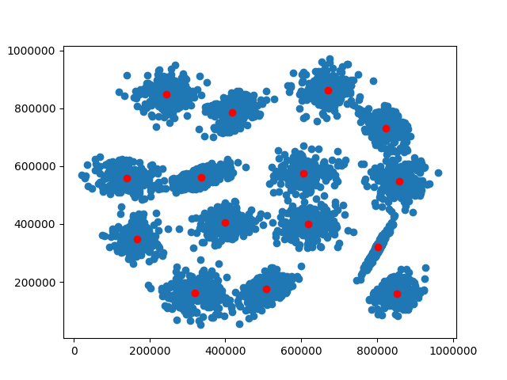

K-Means Clustering
==================

K-Means Function
----------------

.. autofunction:: pykitml.kmeans

Example: S1 Dataset
-------------------

**Dataset**

:ref:`s1clustering_dataset`

**Training**

.. literalinclude:: ../tests/test_s1_kmeans.py
   :pyobject: test_s1_kmeans
   :lines: 3-
   :end-before: # Assert
   :dedent: 1

**Scatter Plot**

