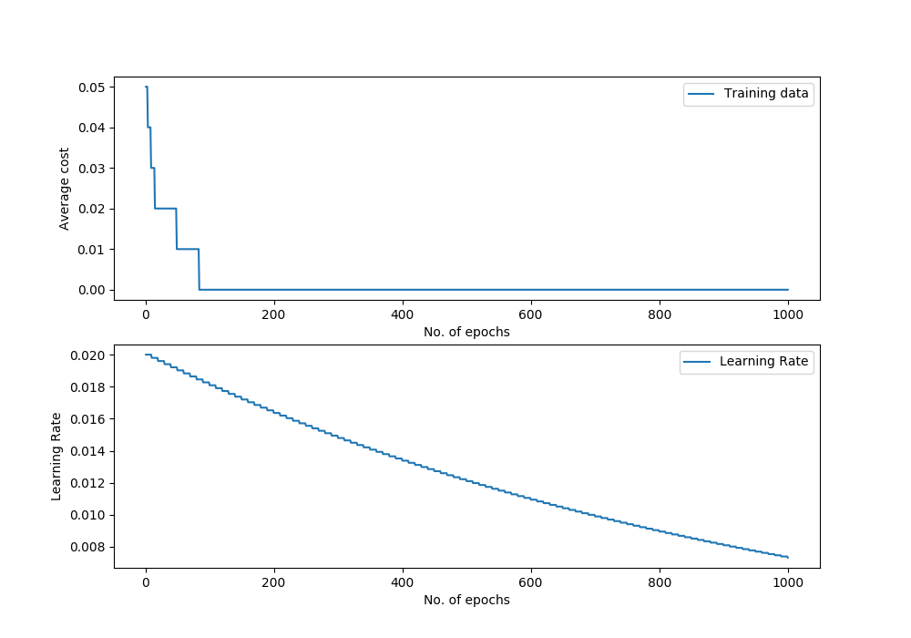

Linear Regression
=================

Class Reference
---------------

.. autoclass:: pykitml.LinearRegression
    
    .. automethod:: __init__

    .. automethod:: feed

    .. automethod:: get_output

    .. automethod:: train

    .. automethod:: plot_performance

    .. automethod:: r2score

    .. automethod:: cost

Example: Predicting Fish Length
-------------------------------
**Dataset**

:ref:`fishlength_dataset`

**Training Model**

.. literalinclude:: ../tests/test_fishlength.py
   :pyobject: test_fishlength
   :lines: 3-
   :end-before: # Assert
   :dedent: 4

**Predict length of fish that is 28 days old at 25C**

.. literalinclude:: ../tests/test_fishlength.py
   :pyobject: test_predict_fishlength
   :lines: 3-
   :dedent: 4

**Performance Graph**

