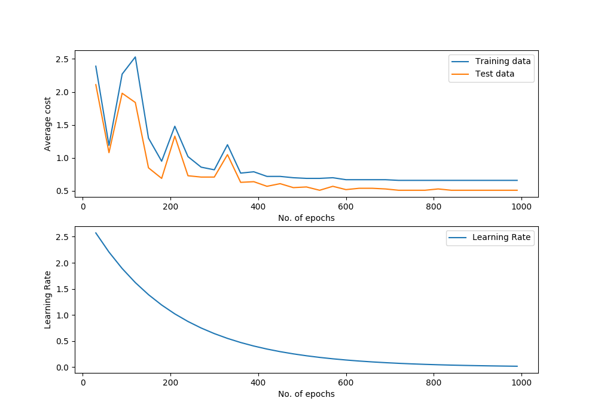

Support Vector Machine with Linear Kernel
=========================================

Class Reference
---------------

.. autoclass:: pykitml.LinearSVM
    
    .. automethod:: __init__

    .. automethod:: feed

    .. automethod:: get_output

    .. automethod:: get_output_onehot

    .. automethod:: train

    .. automethod:: plot_performance

    .. automethod:: cost

    .. automethod:: accuracy

    .. automethod:: confusion_matrix

Example: Classifying Iris
-------------------------

**Dataset**

:ref:`iris_dataset`

**Training**

.. literalinclude:: ../tests/test_iris_svm.py
   :pyobject: test_iris_svm
   :lines: 2-
   :end-before: # Assert
   :dedent: 1

**Predict type of species with sepal-length, sepal-width, petal-length, petal-width: 
5.8, 2.7, 3.9, 1.2**

.. literalinclude:: ../tests/test_iris_svm.py
   :pyobject: test_predict
   :lines: 2-
   :dedent: 1

**Performance Graph**

**Confusion Matrix**

.. image :: ./demo_pics/linear_svm_confusion_matrix.png
