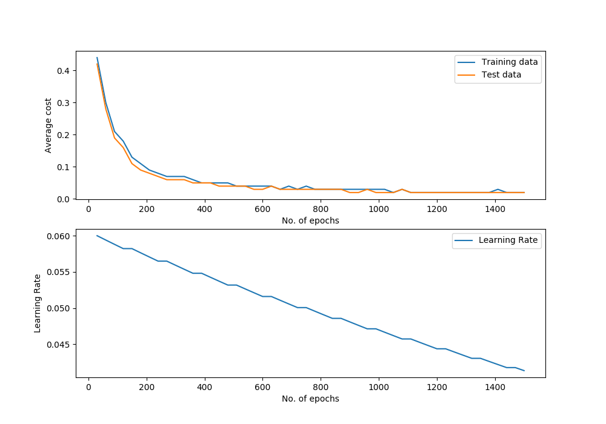
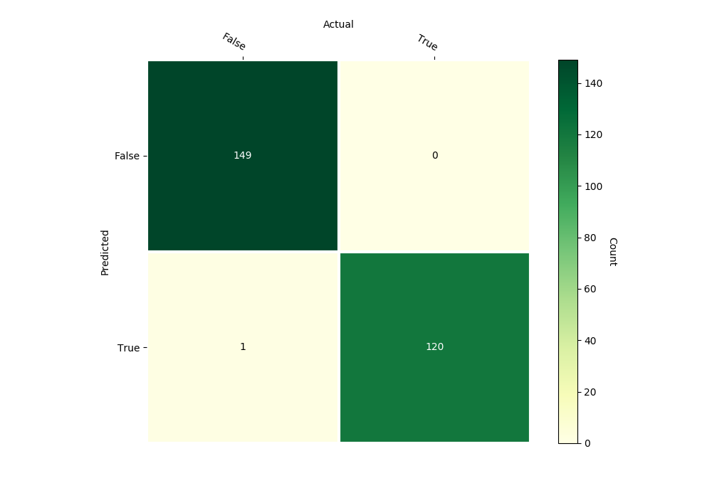

Logistic Regression
===================

Class Reference
---------------

.. autoclass:: pykitml.LogisticRegression
    
    .. automethod:: __init__

    .. automethod:: feed

    .. automethod:: get_output

    .. automethod:: get_output_onehot

    .. automethod:: train

    .. automethod:: plot_performance

    .. automethod:: cost

    .. automethod:: accuracy

    .. automethod:: confusion_matrix

Example: Banknote Authentication
--------------------------------

**Dataset**

:ref:`banknote_dataset`

**Training**

.. literalinclude:: ../tests/test_banknote.py
   :pyobject: test_banknote
   :lines: 3-
   :end-before: # Assert
   :dedent: 4

**Predict banknote validity with variance, skewness, curtosis, entropy: 
-2.3, -9.3, 9.37, -0.86**

.. literalinclude:: ../tests/test_banknote.py
   :pyobject: test_predict_banknote
   :lines: 3-
   :dedent: 4

**Performance Graph**

**Confusion Matrix**

