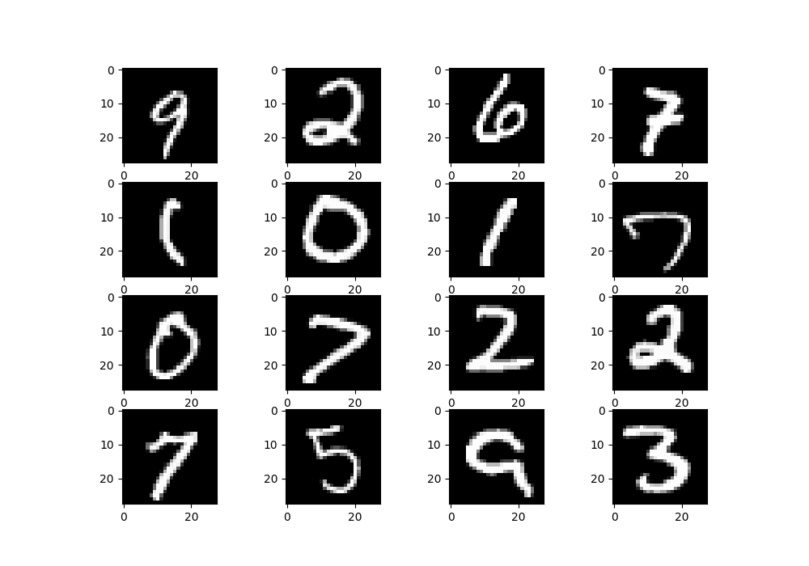
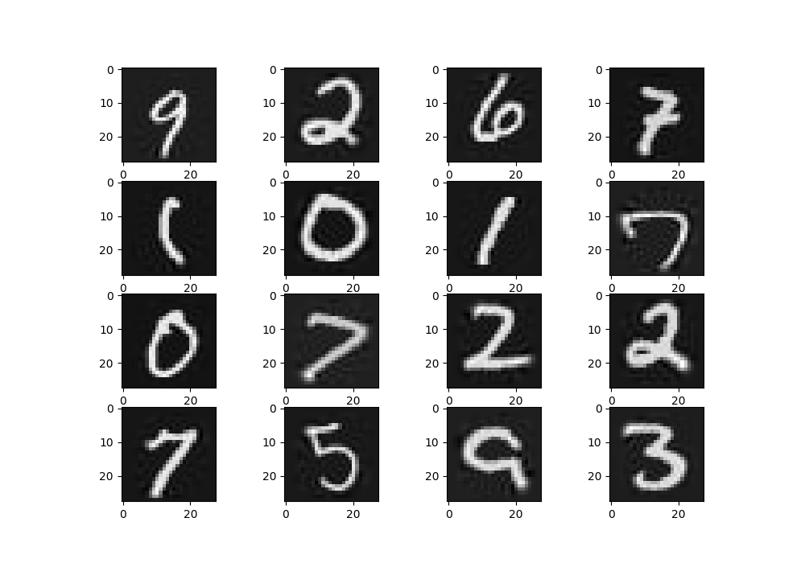

Principal Component Analysis
============================

Class Reference
---------------

.. autoclass:: pykitml.PCA
    
    .. automethod:: __init__

    .. automethod:: transform

    .. automethod:: inverse_transform

    .. autoattribute:: retention

Example: Compressing Fashion MNIST dataset
------------------------------------------

.. literalinclude:: ../tests/test_pca.py
   :pyobject: test_pca_compression
   :lines: 3-
   :dedent: 1

**Original/Uncompressed**

**Recovered/Compressed**

