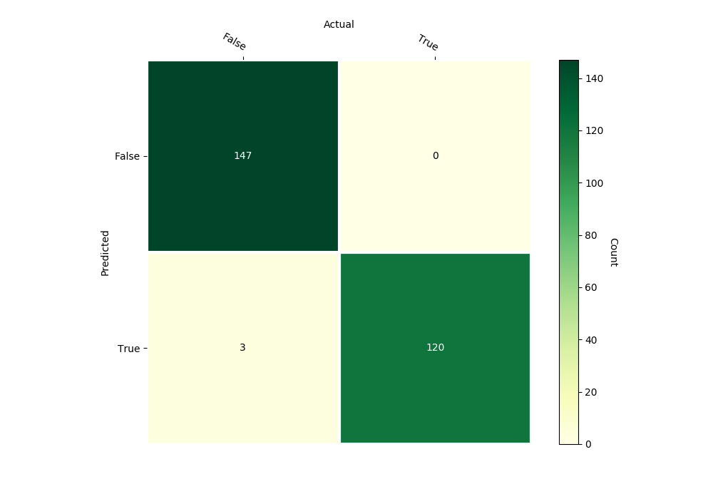
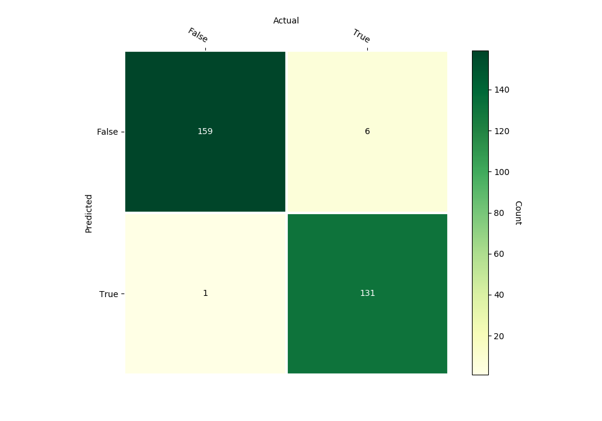

Random Forest
=============

Class Reference
---------------

.. autoclass:: pykitml.RandomForest
    
    .. automethod:: __init__

    .. automethod:: feed

    .. automethod:: get_output

    .. automethod:: get_output_onehot

    .. automethod:: train

    .. automethod:: accuracy

    .. automethod:: r2score

    .. automethod:: confusion_matrix

    .. autoattribute:: trees

Example: Banknote Authentication
--------------------------------

**Dataset**

:ref:`banknote_dataset`

**Training**

.. literalinclude:: ../tests/test_banknote_forest.py
   :pyobject: test_banknote_forest
   :lines: 3-
   :end-before: # Assert
   :dedent: 4

**Predict banknote validity with variance, skewness, curtosis, entropy: 
-2.3, -9.3, 9.37, -0.86**

.. literalinclude:: ../tests/test_banknote_forest.py
   :pyobject: test_predict_banknote_forest
   :lines: 3-
   :dedent: 4

**Confusion Matrix**

Example: Heart Disease Prediction
---------------------------------

**Dataset**

:ref:`heart_dataset`

**Training**

.. literalinclude:: ../tests/test_heart_forest.py
   :pyobject: test_heart_forest
   :lines: 3-
   :end-before: # Assert
   :dedent: 4

**Predict heartdisease for a person with 
age, sex, cp, trestbps, chol, fbs, restecg, thalach, exang, oldpeak, slope, ca, thal:
67, 1, 4, 160, 286, 0, 2, 108, 1, 1.5, 2, 3, 3**

.. literalinclude:: ../tests/test_heart_forest.py
   :pyobject: test_predict_heart_forest
   :lines: 3-
   :dedent: 4

**Confusion Matrix**

