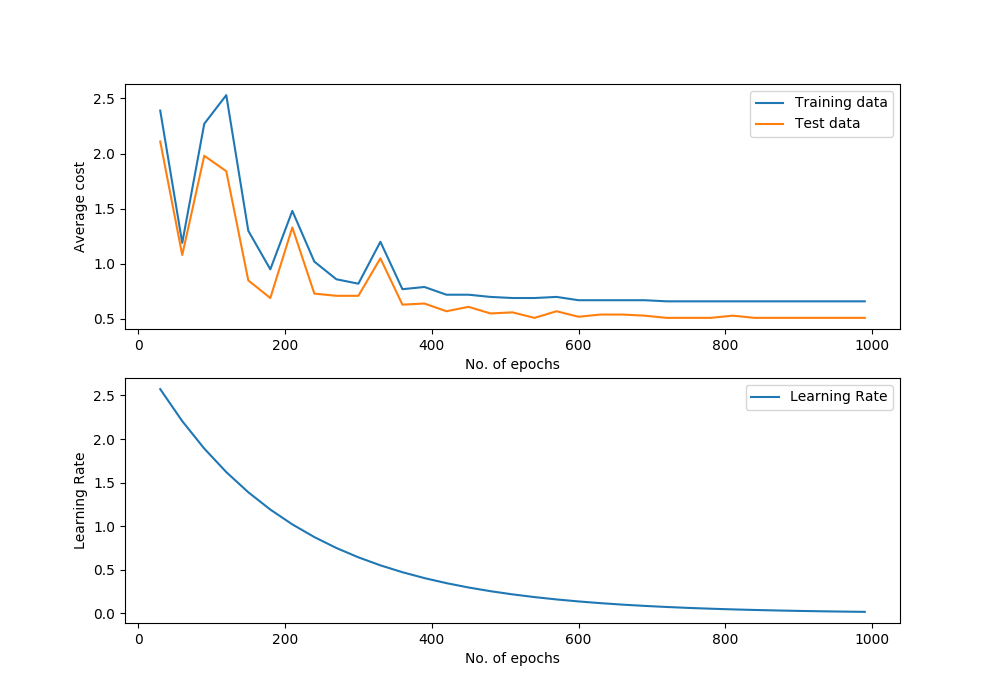

Support Vector Machine
======================

Class Reference
---------------

.. autoclass:: pykitml.SVM
    
    .. automethod:: __init__

    .. automethod:: feed

    .. automethod:: get_output

    .. automethod:: get_output_onehot

    .. automethod:: train

    .. automethod:: plot_performance

    .. automethod:: cost

    .. automethod:: accuracy

    .. automethod:: confusion_matrix

Gaussian Kernel
---------------

.. autofunction:: pykitml.gaussian_kernel

Example: Classifying Iris Using SVM with Linear Kernel
------------------------------------------------------

**Dataset**

:ref:`iris_dataset`

**Training**

.. literalinclude:: ../tests/test_iris_svm.py
   :pyobject: test_iris_svm
   :lines: 3-
   :end-before: # Assert
   :dedent: 4

**Predict type of species with sepal-length, sepal-width, petal-length, petal-width: 
5.8, 2.7, 3.9, 1.2**

.. literalinclude:: ../tests/test_iris_svm.py
   :pyobject: test_predict_iris_svm
   :lines: 3-
   :dedent: 4

**Performance Graph**

**Confusion Matrix**

.. image :: ./demo_pics/linear_svm_confusion_matrix.png

Example: Handwritten Digit Recognition (MNIST) using Gaussian Kernel
--------------------------------------------------------------------

**Dataset**

:ref:`mnist_dataset`

**Training**

.. literalinclude:: ../tests/test_mnist_svm.py
   :pyobject: test_mnist_svm
   :lines: 3-
   :end-before: # Assert
   :dedent: 4

**Predicting**

.. literalinclude:: ../tests/test_mnist_svm.py
   :pyobject: test_predict_mnist_svm
   :lines: 3-
   :dedent: 4

**Performance Graph**

**Confusion Matrix**

